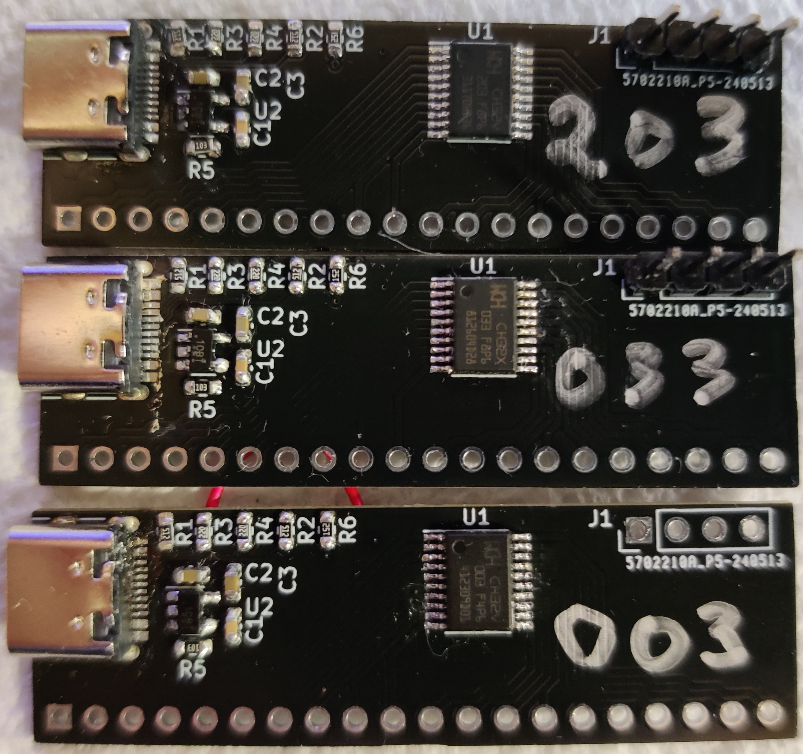
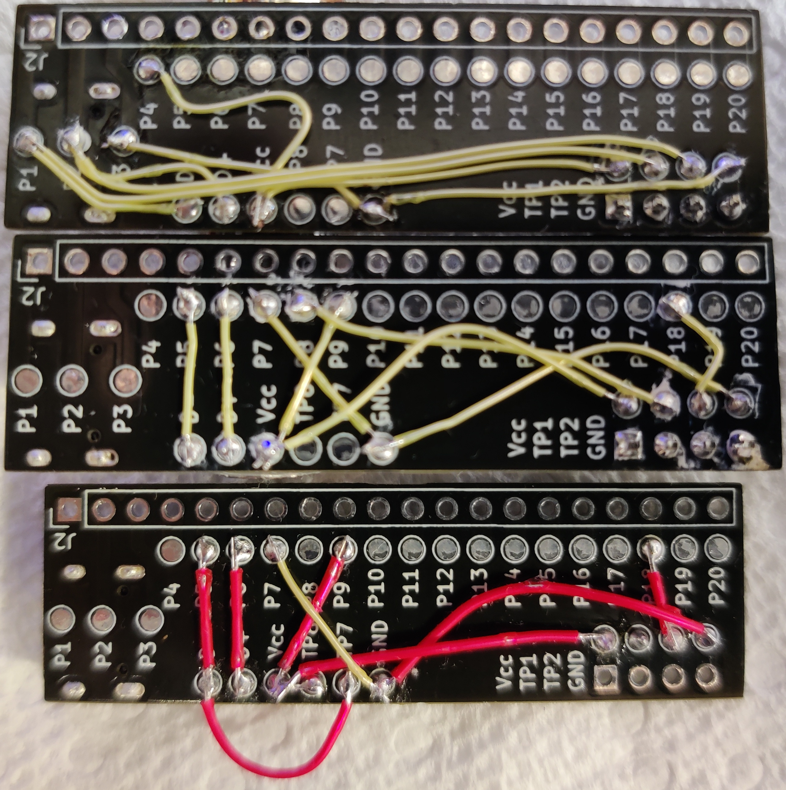

# TSSOP20_breakout
A generic breakout board for TSSOP20 chips to a SIP header meant for breadboard use

New V3 coming shortly

## Features
- USB-C connection for power and/or data (proper dual 5.1K CC termination resistors)
- SO-23-5 regulator with optional stabilization capacitor
- four pin debug header with power, ground, and two additonal signals
- fully uncommitted power, ground, and USB data pins
- test pads on the back side to connect power, ground, and USB signals, etc.
- bypassable regulator (place a diode across the input to output to bypass and provide backfeed protection to the USB power
- optional component pad--useful for low speed USB for chips which lack a PHY and need a 1.5K pullup to signal bus presance
- 20x0.1" SIP header for mounting off the edge of a breadboard.  This allows the bulk of the breadboard to be use for interconnects and prototyping.
  

# Example boards
## CH32V203, CH32X033, and CH32V003

# BOM
This is more of a guidance than a specific BOM as it will vary with the features needed on the board and the needs of the specific chip being used.

## USB-C parts
- J4 -- USB-C USB2.0 receptacle Example: LCSC C2988369 Mfr. Part#: GT-USB-7010ASV
- R1, R2 -- USB CC1/2 termination resistors 5.1 KOhm Example: LCSC
- R3, R4 -- USB serial termination resistors 22 Ohm Example LCSC C3016215 Mfr. Part #: SCR0603F22R
- R6 -- USB speed signaling resistor 1.5 KOhm 0603 generic resistor (see other R part numbers)

## Power regulator parts
- R5 --  (not needed due to schematic error) Regulator Enable pullup resistor 10 KOhm Example: LCSC C3017715 Mfr. Part #: SCR0603J10K
- C1 -- Regulator Bypass stabilization capacitor 22 nF Example: LCSC C302021 Mfr. Part #: 0603B223K500CT
- C2, C3 -- Regulator Bypass capacitor 1 uF Example: LCSC C59782 Mfr. Part #: CL10B105KO8NNNC
- U2 -- SO23-5 regulator Example: 3.3V RT9193-33PB (needs C1), TLV743P33PDVB (does not need C1)

## SIP header and programming header
- J1, J2 -- I don't have specific part numbers for these because I have boxes of them and I just use what I need.  It's a generic 0.1"
 pin header, nothing special.
