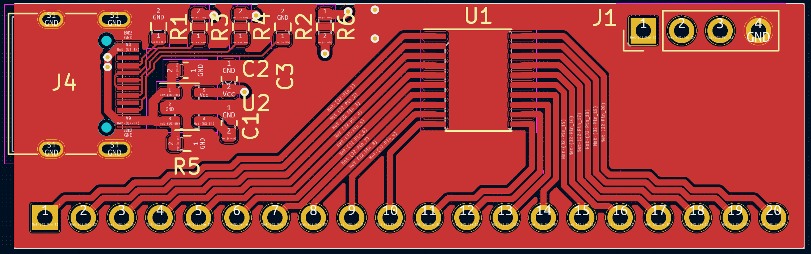
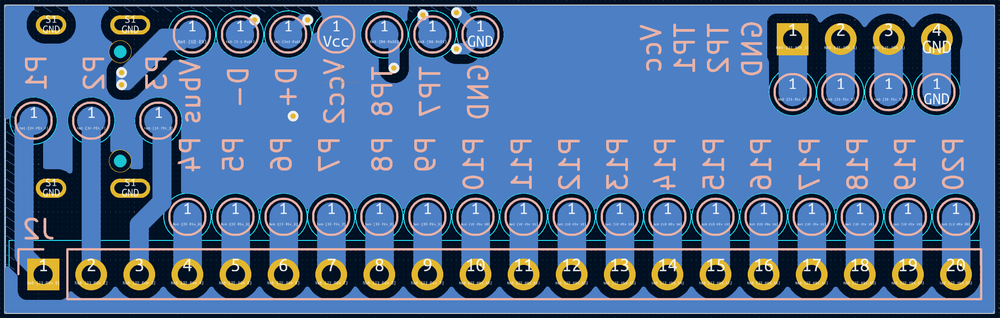
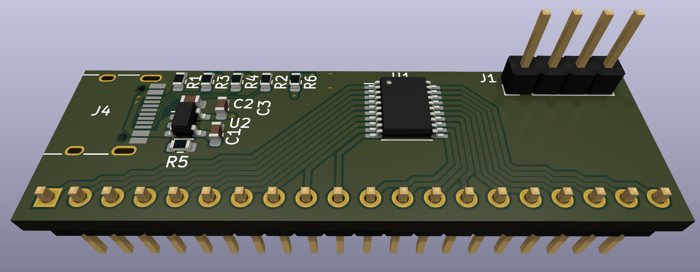
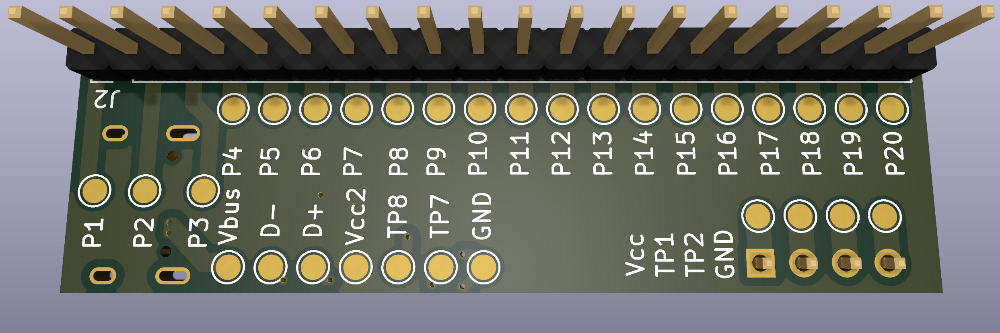

# TSSOP20_breakout
A generic breakout board for TSSOP20 chips to a SIP header meant for breadboard use

## Features
- USB-C connection for power and/or data (proper dual 5.1K CC termination resistors)
- SO-23-5 regulator with optional stabilization capacitor
- four pin debug header with power, ground, and two additonal signals
- fully uncommitted power, ground, and USB data pins
- test pads on the back side to connect power, ground, and USB signals, etc.
- bypassable regulator (place a diode across the input to output to bypass and provide backfeed protection to the USB power
- optional component pad--useful for low speed USB for chips which lack a PHY and need a 1.5K pullup to signal bus presance
- 20x0.1" SIP header for mounting off the edge of a breadboard.  This allows the bulk of the breadboard to be use for interconnects and prototyping.
  

